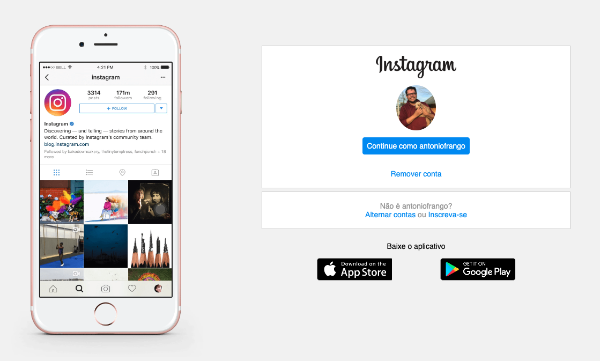

## 💻 Projeto

Esse projeto foi desenvolvido através do [bootcamp HTML Web Developer](https://web.digitalinnovation.one/track/html-web-developer) oferecido pela [Digital Innovation One - DIO](https://digitalinnovation.one/). O projeto teve como objetivo recriar a página inicial do Instagram, que consiste na página de login. No seu desenvolvimento se usou HTML e CSS, onde na configuração do CSS foi utilizado para entender o seu conceito e uso a propriedade Flexbox para o posicionamento dos elementos e a funcionalidade de responsividade para que o layout do site se posicione adequadamente em telas de computador, tablet (1024px) e celulares (650px).

O resultado da aplicação pode ser acessado através da seguinte URL: [Clique aqui](https://antoniocunhadev.github.io/pagina-inicial-do-instagran/)

## 📋 Tecnologias 

O projeto foi desenvolvido com as seguintes tecnologias:

- HTML
- CSS

## 🎨 Layout

## 🧑‍💻 Mudanças implementadas: 

* Foto dos dois celulares: No projeto original só era usado um.

* Tamanho das boxs: Tentei deixar o mais próximo possível do real.

* Responsividade: Tentei ser o mais fiel possível aos tamanhos de tela, que percebi que era usado inspecionando a página original, mas tive um pouco de dificuldades para implementar algumas coisas com as Flexboxs.

* Alterei a largura das imagens ".app-download" (para baixar o aplicativo) de 10rem para 10.2rem, pois a primeira estava sendo cortada no lado direito.
